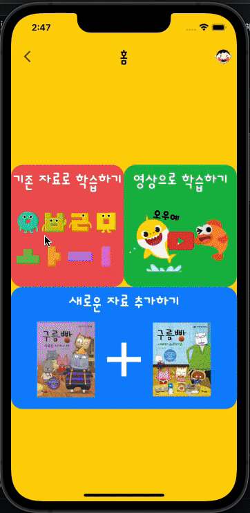

# ALL-Bareumi_FE

Flutter FrontEnd Code

## Now
- 앱 페이지 구현중
  - 사용자 환경설정 페이지
  - 학습 완료 페이지

- 카메라 연동 이후 실제 기기에서 확인하거나, 안드로이드 애뮬레이터로 확인해보기
- 

## Done
- 로그인 구현
- 앱 페이지 4/5 구현 완료(세부 디자인 반영 안되어있음)
- 카메라 연동 완료 (세부 디자인 제외)
  - 내 캐릭터 생성할 때 -> 얼굴인식 카메라 적용
  - 이외에는 일반 카메라 적용 (이후 학습 페이지의 카메라는 바꿀 예정)
- 캐릭터 선택 후 로딩페이지늬 로딩 시간 임의 설정 (1.5초) - 이후 백에서 처리 완료 후 넘기기 예정
- 비디오 연결 완료
- 학습 자료에 대한 객체 생성 완료 및 로컬 환경에서 확인할 수 있음.

## Design

